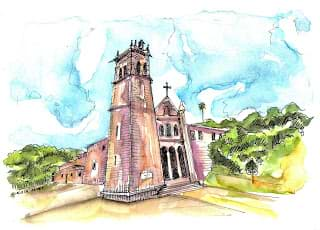

<!-- PROJECT SHIELDS -->
<!--
*** I'm using markdown "reference style" links for readability.
*** Reference links are enclosed in brackets [ ] instead of parentheses ( ).
*** See the bottom of this document for the declaration of the reference variables
*** for contributors-url, forks-url, etc. This is an optional, concise syntax you may use.
*** https://www.markdownguide.org/basic-syntax/#reference-style-links
-->

<!-- PROJECT LOGO -->
<br />
<p align="center">
  <a href="https://github.com/LuchoTurtle/landim-website">
    
  </a>

  <h3 align="center">Mosteiro de Landim's Website</h3>

  <p align="center">
    The repo where Mosteiro de Landim's new website was developed.
    <br />
    <a href="https://github.com/LuchoTurtle/landim-website#Personalization"><strong>Configure the website »</strong></a>
  </p>
</p>


<!-- ABOUT THE PROJECT -->
## About The Project

[![Website Screen Shot][product-screenshot]]()

The previous Mosteiro de Landim website was developed back in 2006 and, as such, has become outdated as time passed. The site was, at the time of writing, unresponsive and used deprecated technologies. This, of course, had an impact on the user experience and on Mosteiro de Landim itself.

With this in mind, I set off to develop a website for Mosteiro de Landim that was simple and responsive, meaning it could be used on both mobile and desktop platforms. It was a learning experience, to say the least!

Some objectives that I set out include:
* Website should be easy to use, lightweight and compatible with IE.
* Keep the same information that was in the previous website and expand upon it.
* Make it easily customizable for anyone who wants to change the information that resides within.

Of course, these are a rough draft. You may also suggest changes by forking this repo and creating a pull request or opening an issue.

A list of commonly used resources that I found helpful are listed in the acknowledgements.

### Built With
* [Gatsby](https://www.gatsbyjs.org/)


<!-- GETTING STARTED -->
## Getting Started

This is an example of how you may give instructions on setting up your project locally.
To get a local copy up and running follow these simple example steps.

### Prerequisites
You need to have npm or yarn installed to run and deploy the website. Make sure to follow [these](https://www.npmjs.com/get-npm) instructions.
You also need Gatsby installed. Head [here](https://www.gatsbyjs.org/tutorial/part-zero/#using-the-gatsby-cli) and follow the instructions. After these, you should be all set!

### Installation

1. Clone the repo
```sh
git clone https://github.com/mosteirodelandim/landim-website.git
```
2. Install NPM packages
```sh
npm install
```

3. Run it!

- To run locally:
```sh
gatsby develop
```

- To deploy the website:
```sh
gatsby build
```
This does a production build of the website and outputs the build static files into the ```public``` directory. After this:
```sh
cd public
surge
```

### Personalization

Edit `config.js` to put up general details regarding social media and main titles. For translation files, head to ```i18n\locales\``` and translate each JSON file accordingly.

```javascript
module.exports = {

  /* Information for SEO */
  siteTitle: 'Mosteiro de Landim',
  siteDescription: 'Mosteiro de Landim description.',
  siteKeywords: ['mosteiro', 'quinta', 'casamento', 'eventos'],
  siteOGPThumbnail: 'https://cidadehoje.pt/wp-content/uploads/2017/08/Mosteiro-de-Landim.jpg',

  manifestName: 'Mosteiro de Santa Maria de Landim',
  manifestShortName: 'Mosteiro de Landim',
  manifestStartUrl: '/',
  manifestBackgroundColor: '#ec8d81',
  manifestThemeColor: '#ec8d81',
  manifestDisplay: 'standalone',
  manifestIcon: 'src/assets/images/common/website-icon.png',
  pathPrefix: '',

  // PAGES ---------------------

  emailContact: '*****',
  phoneContact: '*****',

  // 404
  houseDogs: ['Ringo', 'Spot'],

  // Maps
  mapLocation: {
    center: {
      lat: 41.379464,
      lng: -8.463912,
    },
    zoom: 18,
  },

  // Map deep links
  googleMaps: 'http://maps.apple.com/?daddr=Alameda+de+Mosteiro,+4770-328+Vila+Nova+de+Famalicão&dirflg=d&t=m',
  waze: 'https://www.waze.com/ul?ll=41.38005480%2C-8.46451290&navigate=yes',
};

```


<!-- LICENSE -->
## License

[](LICENSE)

Distributed under the MIT License.


<!-- ACKNOWLEDGEMENTS -->
## Acknowledgements
* [Lottie](https://github.com/felippenardi/lottie-react-web)
* [I18next](https://github.com/i18next/react-i18next)
* [React Image Gallery](https://github.com/xiaolin/react-image-gallery)
* [React Image Lightbox](https://github.com/frontend-collective/react-image-lightbox)
* [Typewriter Effect](https://www.npmjs.com/package/typewriter-effect)


<!-- MARKDOWN LINKS & IMAGES -->
<!-- https://www.markdownguide.org/basic-syntax/#reference-style-links -->
[product-screenshot]: rm_images/landing_page.png
